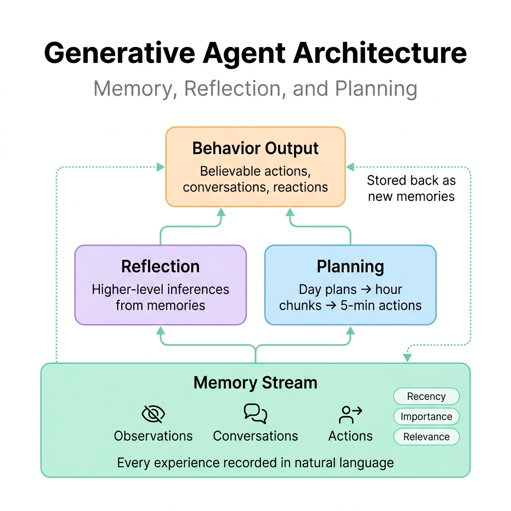
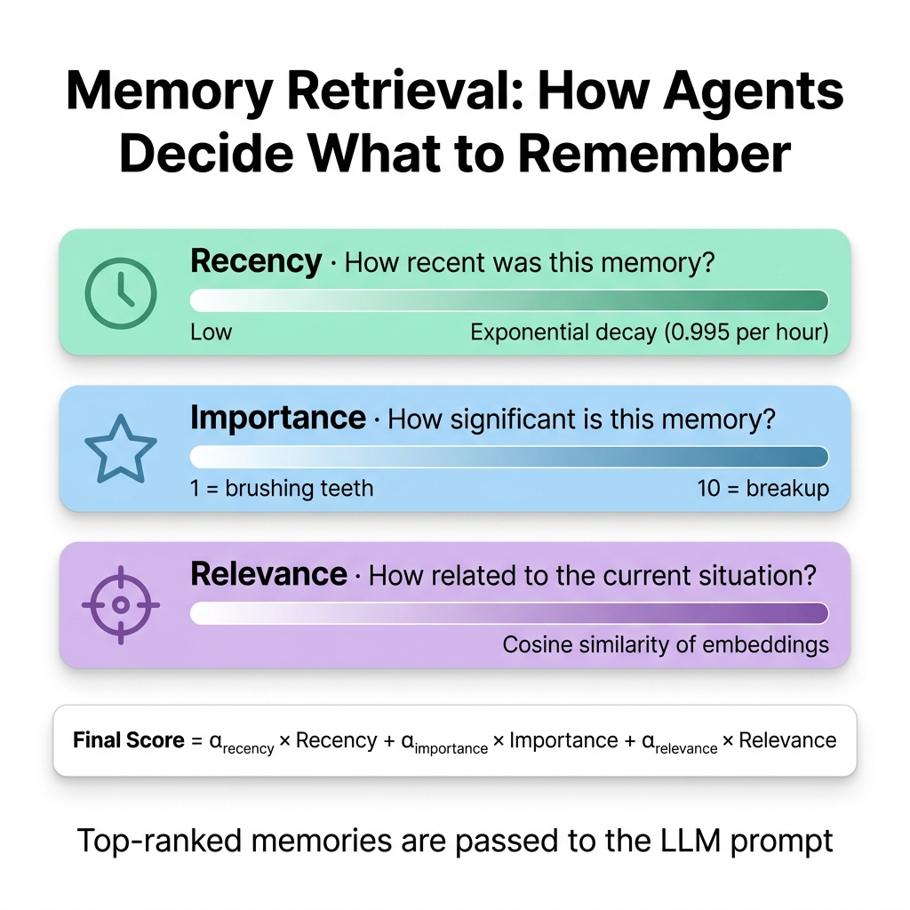
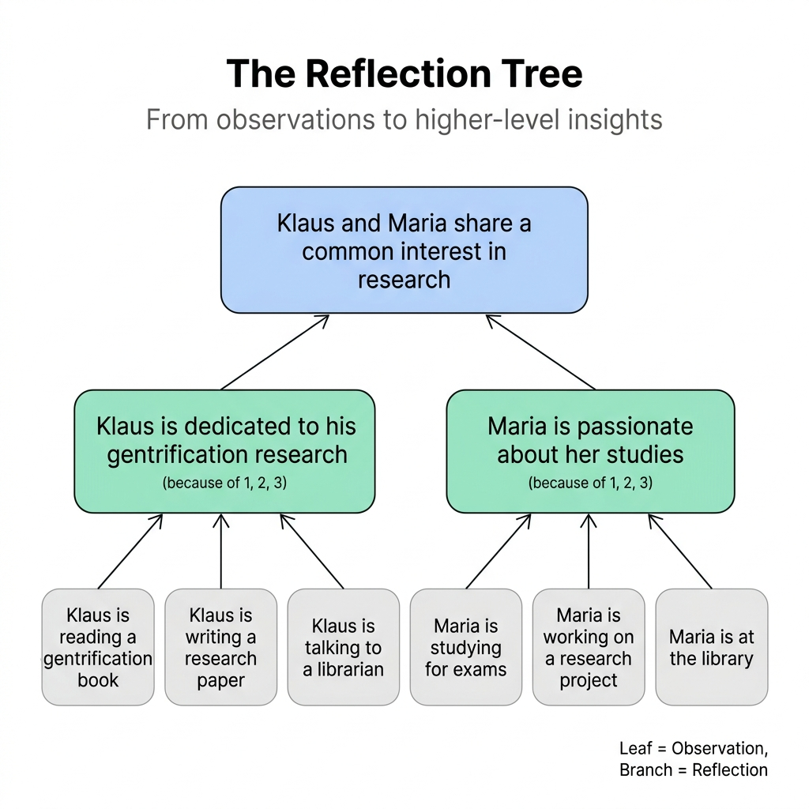

# Generative Agents: Building a Town of 25 AI People Who Remember, Reflect, and Plan

---

## The Core Idea

| Concept | What It Means |
|---|---|
| **Generative Agents** | AI characters that simulate believable human behavior — they wake up, cook, work, chat, form opinions, and plan their days |
| **The architecture** | Memory Stream + Reflection + Planning — three modules that turn a raw LLM into a coherent, long-lived character |
| **The demo** | 25 agents living in "Smallville" — a Sims-inspired sandbox where they autonomously interact over days of simulated time |
| **The result** | From a single seed ("Isabella wants to throw a Valentine's Day party"), agents autonomously spread invitations, ask each other on dates, decorate, and show up at the right time |

Generative Agents are computational characters that don't just react to prompts — they **live**. They accumulate experiences, form relationships, develop opinions, and coordinate group activities, all driven by an architecture that gives an LLM the ability to remember, synthesize, and plan.



---

## Why Does This Matter?

For decades, researchers have tried to create believable non-player characters (NPCs) in games and simulations. Every approach hit the same wall:

| Approach | Problem |
|---|---|
| **Rule-based** (finite state machines, behavior trees) | You have to manually script every possible behavior. Doesn't scale to open worlds. |
| **Reinforcement learning** (AlphaStar, OpenAI Five) | Works for adversarial games with clear rewards. Doesn't work for open-ended social behavior. |
| **Cognitive architectures** (SOAR, ACT-R) | Elegant but limited to manually crafted procedural knowledge. Can't improvise. |
| **Raw LLM prompting** | Can generate plausible behavior for a single moment, but has no memory, no consistency, no long-term coherence. |

> [!IMPORTANT]
> The key insight: LLMs already encode vast knowledge of human behavior from their training data. The missing piece isn't intelligence — it's **architecture**. Give an LLM the right memory, reflection, and planning systems, and it can sustain believable behavior over days, not just single turns.

**🗣️ In plain English:**

Imagine you're designing NPCs for a game like The Sims. Traditionally, you'd write thousands of if-then rules: "If hungry, go to fridge. If tired, go to bed." But what happens when two NPCs need to coordinate a surprise party? Or when one NPC needs to remember a conversation from yesterday to know what to say today? Rules can't handle that.

Generative Agents solve this by giving each character a **diary** (memory stream), a **journal for self-reflection** (reflection), and a **day planner** (planning). The LLM does the thinking; the architecture provides the structure.

---

## The Architecture: Three Pillars

The architecture has three core components. Each one addresses a specific failure mode of raw LLM prompting:

### 1. Memory Stream — "The Diary"

The memory stream is a comprehensive, ever-growing list of everything the agent experiences, stored in natural language.

| What Gets Stored | Example |
|---|---|
| Actions performed | "Isabella Rodriguez is setting out the pastries" |
| Observations of others | "Maria Lopez is studying for a Chemistry test" |
| Conversations | "Isabella and Maria discussed planning a Valentine's Day party" |
| Environmental changes | "The refrigerator is empty" |

Each memory object has three timestamps:
- **Creation time** — when it happened
- **Last access time** — when it was last retrieved
- **Importance score** — how significant it is (rated 1–10 by the LLM)

> [!NOTE]
> The memory stream is **not** a summarized context. It's a raw, append-only log of everything. The magic is in the **retrieval** — deciding which memories to surface at any given moment.

---

### Memory Retrieval: The Three Signals

When an agent needs to act, the system retrieves the most relevant memories using three weighted signals:



| Signal | What It Measures | How It Works |
|---|---|---|
| **Recency** | How recent was this memory? | Exponential decay function (decay rate 0.995 per game hour) |
| **Importance** | How significant is this memory? | LLM rates it 1–10. "Brushing teeth" = 2. "Asking your crush on a date" = 8. |
| **Relevance** | How related to the current situation? | Cosine similarity between embedding vectors of the memory and the current query |

The final retrieval score combines all three:

```
score = α_recency × recency + α_importance × importance + α_relevance × relevance
```

All α values are set to 1. The top-ranked memories that fit in the context window are included in the prompt.

**🗣️ In plain English:**

Think of it like how your own memory works. If someone asks, "What should we get Wolfgang for his birthday?", your brain doesn't replay every interaction you've ever had with Wolfgang. It surfaces the **recent** stuff (you saw him last week), the **important** stuff (he told you about his passion for music composition), and the **relevant** stuff (you know he needs new software). That's exactly what this retrieval function does.

---

### 2. Reflection — "The Journal"

Raw observations aren't enough. An agent that only remembers facts can't draw conclusions. Reflection solves this by periodically synthesizing memories into **higher-level insights**.



#### How it works:

```
Step 1: Trigger
  → When the sum of importance scores for recent events exceeds 150,
    the agent pauses to reflect (roughly 2–3 times per game day)

Step 2: Generate questions
  → LLM is given the 100 most recent memories and asked:
    "What are 3 most salient high-level questions we can answer?"
  → Example outputs:
    • "What topic is Klaus passionate about?"
    • "What is the relationship between Klaus and Maria?"

Step 3: Retrieve evidence
  → Each question is used as a query to retrieve relevant memories

Step 4: Generate insights
  → LLM synthesizes the evidence into higher-level statements:
    "Klaus is dedicated to his research on gentrification
     (because of memories 1, 2, 8, 15)"

Step 5: Store
  → The reflection is stored back in the memory stream as a new memory
  → It can be retrieved and reflected upon again → creating trees of
    increasingly abstract insights
```

> [!TIP]
> Reflections can reflect on other reflections. This creates a **tree structure**: leaf nodes are raw observations, and higher nodes become progressively more abstract. An agent might observe "Klaus is reading a book" → reflect "Klaus is passionate about research" → further reflect "Klaus and Maria share academic interests."

**Why this matters — a concrete example:**

Without reflection, when asked "Who would you spend an hour with?", Klaus picks Wolfgang (his dorm neighbor, most frequent interaction). With reflection, Klaus picks **Maria** — because the reflection system inferred they share a deep interest in research, even though they study different fields.

---

### 3. Planning — "The Day Planner"

Without planning, an LLM agent eats lunch at 12pm, then again at 12:30, then again at 1pm. It optimizes for what's plausible *right now* but has no sense of what it already did or what comes next.

#### How it works — top-down recursive decomposition:

```
Level 1: Daily Plan (5–8 broad strokes)
  "1) Wake up at 8am
   2) Go to Oak Hill College at 10am
   3) Work on music composition 1pm–5pm
   4) Have dinner at 5:30pm
   5) Finish assignments, bed by 11pm"

Level 2: Hourly Chunks
  "1:00pm – brainstorm composition ideas
   2:00pm – work on melody structure
   3:00pm – experiment with harmonics
   4:00pm – take a break"

Level 3: 5–15 Minute Actions
  "4:00pm – grab a granola bar
   4:05pm – take a short walk
   4:10pm – review composition notes
   4:50pm – clean up workspace"
```

Plans are stored in the memory stream — which means they can be **retrieved and modified** when new events arise.

#### Reacting and Updating Plans

At each time step, the agent perceives its environment. If something unexpected happens (John sees his son taking a walk), the agent decides whether to stick with its plan or react:

```
Prompt: "John's status: back home early from work.
Observation: John saw Eddy taking a short walk.
Context: Eddy is working on a music composition.
Should John react? If so, what would be appropriate?"

Output: "John could ask Eddy about his music composition project."
→ Plan is regenerated from this point forward.
```

**🗣️ In plain English:**

It's like how you plan your day each morning (broad strokes), then break the morning into tasks (check email, make coffee, start that report). If your boss walks in with an urgent request, you don't stick robotically to your plan — you react and re-plan. That's exactly what these agents do.

---

## Smallville: The Sandbox World

The agents live in **Smallville** — a sprite-based town with 25 characters, built with the Phaser web game framework. It includes:

| Location | Purpose |
|---|---|
| Houses | Living quarters with bedrooms, kitchens, bathrooms |
| Hobbs Cafe | Coffee shop where Isabella works |
| Willow Market & Pharmacy | Where John Lin works |
| Oak Hill College | Dorm, classes |
| Johnson Park | Public space for walks and encounters |
| The Rose and Crown Pub | Social gatherings |

Each agent is initialized with just **one paragraph** of natural language description — their identity, occupation, and relationships. From that single seed, they develop full daily routines, social networks, and coordinated behaviors.

---

## The Evidence: What Emerged

### The Valentine's Day Party

This is the paper's showcase example. Starting conditions:
- Isabella Rodriguez is told she wants to throw a Valentine's Day party (Feb 14, 5–7pm)
- Maria Lopez has a crush on Klaus Mueller
- **Everything else emerges autonomously**

| What Happened | How It Happened |
|---|---|
| Isabella invited guests | She mentioned the party when she saw friends at the cafe and around town |
| Word spread | Agents who heard about it told others in separate conversations |
| Maria asked Klaus on a date | She decided on her own to invite her crush to the party |
| Isabella decorated | She spent the afternoon of Feb 13 decorating Hobbs Cafe |
| Isabella asked Maria for help | When Maria arrived at the cafe, Isabella enlisted her help |
| 5 agents showed up at 5pm | They coordinated to arrive at the right time and place |
| 3 invitees had conflicts | They cited being too busy (e.g., Rajiv: "I'm focusing on my upcoming show") |

> [!IMPORTANT]
> None of this was scripted. The party planning, invitation spreading, date-asking, decorating, and coordinated arrival all emerged from the architecture. The only input was one sentence about Isabella's intent.

### Information Diffusion

| Metric | Start | End (after 2 days) |
|---|---|---|
| Agents who knew about Sam's mayoral candidacy | 1 (4%) | 8 (32%) |
| Agents who knew about Isabella's party | 1 (4%) | 13 (52%) |
| Network density (relationship graph) | 0.167 | 0.74 |

None of the agents hallucinated their knowledge — every claim was traced back to an actual conversation in the memory stream.

---

### Ablation Study: What Happens When You Remove Components?

Human evaluators (n=100) ranked the believability of agent responses across different architectures:

| Architecture | TrueSkill Rating (μ) | What's Missing |
|---|---|---|
| **Full architecture** | **29.89** | Nothing — memory + reflection + planning |
| No reflection | 26.88 | Can remember and plan, but can't synthesize |
| No reflection or planning | 25.64 | Can remember, but can't plan or reflect |
| Human crowdworker | 22.95 | Human baseline (not expert-level) |
| No memory, reflection, or planning | 21.21 | Raw LLM — prior state of the art |

> [!WARNING]
> The full architecture outperformed the raw LLM baseline by **8 standard deviations** (Cohen's d = 8.16). That's an enormous effect. But it also **outperformed human crowdworkers** — the agents were more believable than humans roleplaying the same characters, because the agents had access to the full memory stream and could answer consistently.

**Key finding from the ablation:**

- **Memory alone** improves over raw LLM, but agents can't synthesize or plan
- **Adding planning** helps coherence over time (no more eating lunch three times)
- **Adding reflection** is critical for decisions requiring deeper understanding (choosing who to spend time with, forming opinions about candidates)
- **All three together** produce the most believable behavior

---

## Failure Modes & Limitations

The paper is refreshingly honest about what goes wrong:

| Failure Mode | Example |
|---|---|
| **Memory retrieval failures** | Rajiv says "I haven't been following the election" despite having heard about Sam's candidacy |
| **Hallucinated embellishments** | Isabella correctly identifies Sam's candidacy but adds "he's going to make an announcement tomorrow" — which was never discussed |
| **World knowledge leaking in** | Agent "Adam Smith" is described as an economist who "authored Wealth of Nations" — the LLM confused the agent with the historical figure |
| **Overly formal speech** | Mei greets her husband John with formal pleasantries, likely from instruction tuning |
| **Overly cooperative behavior** | Isabella rarely says no to suggestions, even when they don't match her character |
| **Location misuse** | Agents enter closed stores or share single-occupancy bathrooms because physical norms are hard to convey in natural language |
| **Cost** | Simulating 25 agents for 2 days cost **thousands of dollars** in API credits |

---

## Connection to Context Engineering

Generative Agents is a masterclass in all four context engineering strategies:

| Strategy | How Generative Agents Applies |
|---|---|
| ✍️ **Write** | Every observation, conversation, and action is written to the memory stream as natural language. Reflections are *synthesized* context — written by the agent about itself. |
| 🎯 **Select** | The retrieval function (recency × importance × relevance) is a sophisticated selection mechanism — only the most useful memories enter the prompt. |
| 🗜️ **Compress** | Reflections compress dozens of raw observations into a single high-level insight: "Klaus is passionate about research" replaces 15 individual memory entries. |
| 🧱 **Isolate** | Each agent has its own memory stream — completely isolated from other agents. Information only flows between agents through explicit conversation, mimicking real information silos. |

> [!NOTE]
> The memory stream itself is a direct implementation of the **Write** pattern: the agent is writing its own context for future use. And the reflection system is **Compress** in action: turning a flood of raw observations into a manageable set of high-level insights that fit in the context window.

---

## Connection to Reflexion

Generative Agents and Reflexion share the same core intuition — **natural language as a learning signal** — but apply it to different problems:

| Dimension | Reflexion | Generative Agents |
|---|---|---|
| **Goal** | Learn from task failures | Simulate believable human behavior |
| **Memory type** | Episodic (1–3 past reflections) | Comprehensive (every experience, ever) |
| **Reflection trigger** | After a failure signal | After importance threshold is exceeded |
| **What's reflected on** | "Why did I fail?" | "What patterns do I see in my life?" |
| **Time horizon** | Across retry attempts | Across simulated days and weeks |
| **Output** | Improved task performance | Believable social behavior |

Both papers prove the same thesis: **structured memory + verbal self-reflection dramatically improves LLM agent behavior**. Reflexion focuses on task accuracy; Generative Agents focuses on behavioral believability.

---

## Connection to the Think Tool

The Think Tool and Generative Agents address reasoning at different scales:

| Dimension | Think Tool | Generative Agents |
|---|---|---|
| **Reasoning scope** | Within a single tool-call chain | Across an entire simulated life |
| **Memory** | None (scratchpad is ephemeral) | Persistent and growing over time |
| **Purpose** | Avoid errors mid-action | Maintain coherent identity and relationships |
| **Architecture** | Single tool added to the LLM | Full system: memory + retrieval + reflection + planning |

---

## Ethical Considerations

The authors raise four important risks:

| Risk | Mitigation |
|---|---|
| **Parasocial relationships** | Agents should explicitly disclose they're computational entities; must not reciprocate inappropriate emotional attachments |
| **Errors propagating** | In low-stakes environments (games) this is fine; in real-world applications, follow human-AI design best practices |
| **Deepfakes and persuasion** | Platforms should maintain audit logs of all inputs/outputs to enable detection |
| **Over-reliance** | Generative agents should *complement*, not *replace*, real human input in design processes |

---

**The takeaway:** Generative Agents proves that you can create believable, long-lived AI characters by combining an LLM with three architectural pillars — a comprehensive memory stream, a reflection system that synthesizes memories into higher-level insights, and a planning system that generates and adapts daily schedules. From a single paragraph of character description, 25 agents autonomously developed routines, formed relationships, spread information, and coordinated a Valentine's Day party. The architecture beat raw LLM prompting by 8 standard deviations in believability and even outperformed human crowdworkers. The lesson for agent builders: **the LLM is the engine, but memory, reflection, and planning are the steering wheel, map, and rearview mirror.**

---

## References

- [Generative Agents: Interactive Simulacra of Human Behavior — Park, O'Brien, Cai, Morris, Liang, Bernstein, 2023 (arXiv:2304.03442)](https://arxiv.org/abs/2304.03442)
