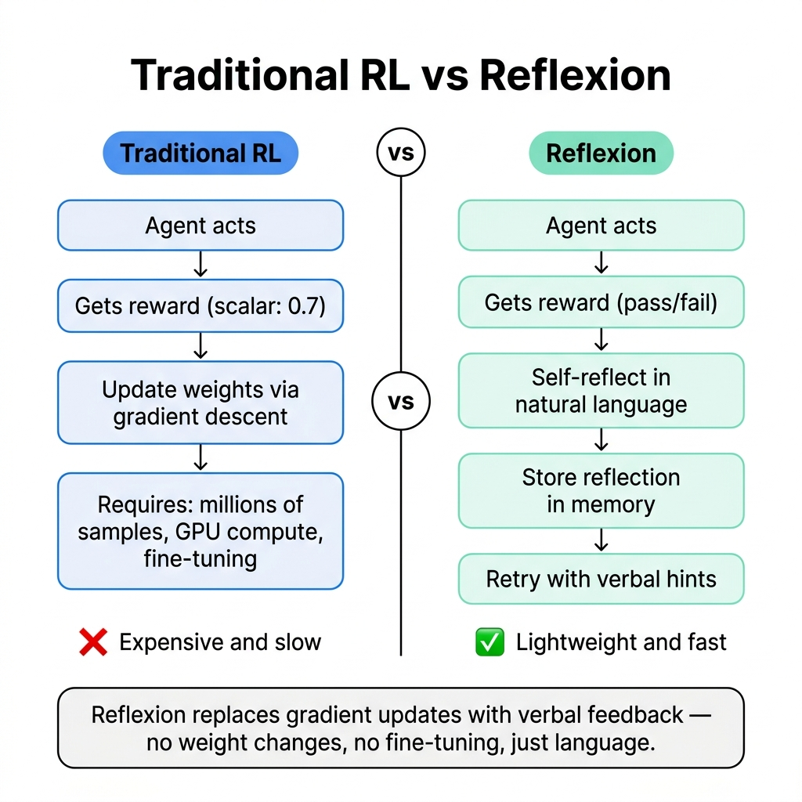
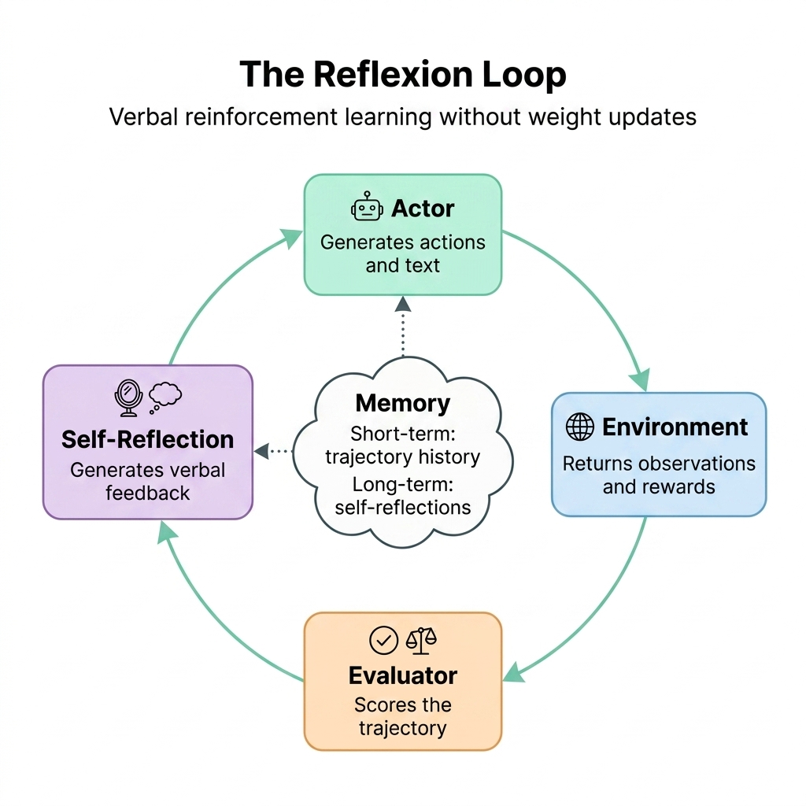
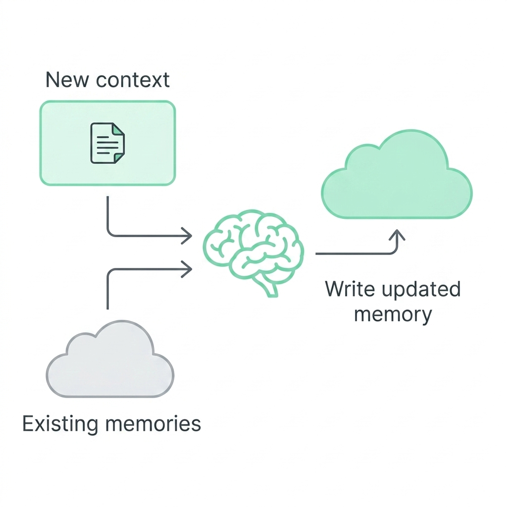

# Reflexion: Teaching LLM Agents to Learn from Their Mistakes — Using Words, Not Gradients

---

## The Core Idea

| Traditional RL | Reflexion |
|---|---|
| Agent fails → gets a scalar reward (0.3) | Agent fails → gets a scalar reward (fail) |
| Compute gradients → update millions of weights | **Self-reflect in natural language** → store the reflection |
| Requires: massive compute, fine-tuning, millions of samples | Requires: **just a few retries and a memory buffer** |
| The "learning" is opaque — buried in weight changes | The "learning" is **readable** — stored as text |

Reflexion is a framework that teaches LLM agents to learn from trial-and-error — not by updating model weights (like traditional RL), but by having the agent **write down what went wrong** and **use that reflection as context in the next attempt**. It's reinforcement learning through language.



---

## Why Does This Matter?

LLM-based agents (like ReAct, HuggingGPT, or generative agents) are increasingly used to interact with environments — games, compilers, APIs, databases. But when they fail, they have no built-in mechanism to **learn from failure**:

| Problem | Impact |
|---|---|
| No memory of past failures | The agent makes the same mistake every time |
| Traditional RL is too expensive | Fine-tuning a 175B-parameter model requires enormous compute |
| Scalar rewards are uninformative | A reward of "0.3" doesn't tell the agent *what* to fix |
| In-context examples are static | Few-shot prompts don't adapt to the agent's *specific* failures |

> [!IMPORTANT]
> The key insight of Reflexion is that **natural language is a more informative feedback signal than a scalar reward**. Telling an agent "you should have checked the fridge before the counter" is far more actionable than telling it "you scored 0.4."

**🗣️ In plain English:**

Imagine you're learning to cook a new recipe. Traditional RL is like someone watching you, saying nothing, and giving you a score out of 10 after each attempt. You got a 4. Why? No idea. You try again, randomly changing things, hoping the score goes up.

Reflexion is like that same person saying: "You added the garlic too late — it burned. Next time, add it after the onions soften, around the 5-minute mark." You write that note down, stick it on the fridge, and the next time you cook, you check your notes first. *That's* Reflexion.

---

## How Does It Work?



Reflexion uses three components working in a loop:

### The Three Models

| Component | Role | Analogy |
|---|---|---|
| **Actor** (Mₐ) | Generates actions and text, interacts with the environment | The student taking the exam |
| **Evaluator** (Mₑ) | Scores the output — was it correct? | The teacher grading the exam |
| **Self-Reflection** (Mₛᵣ) | Analyzes *why* it failed and generates verbal feedback | The student reviewing their mistakes after getting the grade |

### The Loop

```
Trial 1:
  Actor generates trajectory τ₀ (sequence of actions)
  Evaluator scores it: r₀ = fail
  Self-Reflection analyzes {τ₀, r₀} → generates verbal summary sr₀
  sr₀ is stored in Memory

Trial 2:
  Actor generates trajectory τ₁, now conditioned on Memory [sr₀]
  Evaluator scores it: r₁ = fail
  Self-Reflection analyzes {τ₁, r₁} → generates sr₁
  sr₁ is appended to Memory

Trial 3:
  Actor generates trajectory τ₂, conditioned on Memory [sr₀, sr₁]
  Evaluator scores it: r₂ = success ✓
  → Stop.
```

**🗣️ In plain English:**

It's like a student who fails an exam, writes down "I need to study Chapter 5 more" on a sticky note, and brings that sticky note to the retake. If they fail again, they add another note: "Also, I confused mitosis with meiosis — remember the difference." By the third attempt, they've got a short stack of targeted self-corrections that actually help.

> [!NOTE]
> The memory is bounded — typically 1–3 reflections — to avoid exceeding the LLM's context window. This is a form of **context compression**: only the most recent, most relevant lessons are kept.

---

## The Memory System



Reflexion uses two types of memory, mirroring how humans actually learn:

| Memory Type | What It Stores | Analogy |
|---|---|---|
| **Short-term memory** | The current trajectory — every action, observation, and result from *this* trial | Your working memory during an exam |
| **Long-term memory** | Self-reflections from *past* trials — distilled lessons learned | Your study notes from previous exam prep |

At inference time, the Actor conditions its decisions on **both**:
- Fine-grained recent details (short-term)
- Distilled important experiences (long-term)

> [!TIP]
> This dual-memory architecture is a key advantage over other LLM agent frameworks. ReAct, for example, has no mechanism to carry lessons across trials — it starts fresh each time.

---

## The Evidence: Benchmark Results

Reflexion was evaluated across three fundamentally different task types — each testing a different capability:

### 1. Sequential Decision Making: AlfWorld

> AlfWorld challenges agents to complete multi-step household tasks in text-based environments — finding hidden objects, moving items, manipulating objects. These require long action sequences where a single early mistake can derail everything.

| Approach | Tasks Completed (out of 134) | Improvement |
|---|---|---|
| ReAct (baseline) | ~100 | — |
| **ReAct + Reflexion** | **130** | **+22% absolute** |

- Reflexion solved **130 out of 134 tasks** over 12 iterative learning steps
- The baseline ReAct agent plateaued at trials 6–7 with no further improvement
- A simple heuristic detected hallucinations: if the agent repeated the same action 3+ times, or exceeded 30 actions, it triggered self-reflection

**🗣️ In plain English:**

Imagine you're playing a text adventure game. You need to find a spatula that's hidden in a drawer. Without Reflexion, the agent checks the counter, the shelf, the counter again (hallucinating that it already checked the drawer), and gives up. With Reflexion, after failing, it writes: "I hallucinated having the spatula — next time, actually open the drawer and confirm." On the next run, it checks the drawer first.

---

### 2. Reasoning: HotPotQA

> HotPotQA requires multi-hop reasoning over Wikipedia articles — the agent must connect information across multiple documents to answer complex questions.

| Approach | Accuracy | Improvement |
|---|---|---|
| CoT (baseline) | ~39% | — |
| CoT + Reflexion | ~53% | — |
| ReAct + Reflexion | **Best across configs** | **+20% absolute** |

- Reflexion helped **even when the agent already had ground-truth context** — meaning the issue wasn't retrieval, it was *reasoning*
- Self-reflection improved reasoning by an **8% absolute boost** over simple episodic memory (just replaying the last trajectory)
- This proves that **refinement-only approaches are not as effective as self-reflection-guided refinement**

> [!WARNING]
> Simply retrying with the same trajectory in context (episodic memory) is not the same as self-reflection. The verbal explanation — written in first person — is what makes the difference. The agent doesn't just *see* its past attempt; it *diagnoses* what went wrong.

---

### 3. Programming: HumanEval & MBPP

> Coding benchmarks test the agent's ability to write correct function implementations given natural language descriptions, then validate them against test suites.

| Benchmark | Baseline (GPT-4) | Reflexion | Improvement |
|---|---|---|---|
| HumanEval Python | 80% | **91%** | **+11%** |
| HumanEval Rust | 60% | **72%** | +12% |
| MBPP Python | 80% | 78% | −2% (see analysis) |

**Reflexion achieved 91% pass@1 on HumanEval** — surpassing GPT-4's 80% — using self-generated test suites and verbal self-reflection.

#### How the coding loop works:

```
1. Generate function implementation
2. Generate a test suite (up to 6 unit tests via Chain-of-Thought)
3. Filter for syntactically valid tests (via AST parsing)
4. Run tests against implementation
5. If tests fail:
   a. Self-reflect: "What went wrong? Which test failed? Why?"
   b. Store reflection in memory (max 1 experience for code)
   c. Retry with reflection as context
6. If all tests pass → submit
```

> [!CAUTION]
> The MBPP Python underperformance (78% vs 80% baseline) was traced to a **16.3% false positive rate** in self-generated test suites — meaning tests passed on incorrect code. HumanEval had only a 1.4% false positive rate. The quality of self-generated tests is a critical bottleneck.

---

### Ablation Study: What Actually Matters?

The authors tested what happens when you remove parts of the Reflexion pipeline (on the 50 hardest HumanEval Rust problems):

| Configuration | Accuracy | Takeaway |
|---|---|---|
| Full Reflexion (tests + self-reflection) | **Best** | Both components are needed |
| No test generation (self-reflect blind) | 52% (vs 60% baseline) | Without tests, the agent can't tell if code is correct — it makes harmful edits |
| No self-reflection (tests only, blind retry) | = Baseline | Tests catch errors, but *fixes don't stick* without verbal reasoning |

> [!IMPORTANT]
> This is the most important finding: **blind trial-and-error debugging without self-reflection is ineffective on hard tasks**. The agent needs both the signal (tests) AND the reasoning (self-reflection) to improve. Neither alone is sufficient.

**🗣️ In plain English:**

It's like debugging code. If you just re-run the code without reading the error message (no tests), you're guessing. If you read the error message but don't stop to *think* about what it means (no self-reflection), you end up changing random things. You need both: see the error, *then* reason about the fix.

---

## The Four Advantages of Reflexion Over Traditional RL

| Advantage | Why It Matters |
|---|---|
| **Lightweight** | No fine-tuning, no gradient computation — just prompting |
| **Nuanced feedback** | Natural language feedback ("check the fridge first") vs. scalar rewards (0.4) |
| **Interpretable memory** | You can *read* what the agent learned — it's text, not opaque weights |
| **Explicit hints** | Reflections provide concrete, actionable directions for the next trial |

And the disadvantages:

| Limitation | Impact |
|---|---|
| Relies on LLM's self-evaluation quality | If the model can't diagnose its own errors, reflections are useless |
| No formal convergence guarantee | The agent might get stuck in local minima |
| Context window bounded memory | Only 1–3 past reflections fit — older lessons are lost |
| Test suite quality matters (for code) | False positives in self-generated tests → premature incorrect submission |

---

## Connection to Context Engineering

Reflexion is a masterclass in **context engineering** — it's essentially the **Write ✍️** and **Compress 🗜️** strategies from our context engineering framework, applied to learning:

| Strategy | How Reflexion Applies |
|---|---|
| ✍️ **Write** | Self-reflections are *written* context — carefully crafted verbal feedback that enters the context window before the next trial |
| 🗜️ **Compress** | A long failed trajectory is *compressed* into a short, actionable reflection — "I should have checked the fridge, not the counter" |
| 🎯 **Select** | The memory window selects only the most recent 1–3 reflections, preventing context bloat |
| 🧱 **Isolate** | Each trial gets its own trajectory (short-term memory), isolated from past trajectories — only reflections cross trial boundaries |

> [!NOTE]
> Reflexion directly combats **Context Poisoning**. When an agent hallucinates (e.g., thinking it has an item when it doesn't), the self-reflection step identifies and names the hallucination, preventing it from recurring in the next trial. The reflection acts as an antidote to the poison.

---

## Connection to the Think Tool

Reflexion and the Think Tool are complementary approaches that operate at different timescales:

| Dimension | Think Tool | Reflexion |
|---|---|---|
| **When it reasons** | Mid-action (during a single trial) | Between trials (after a failure) |
| **What it reasons about** | "Do I have the right info to proceed?" | "Why did I fail? What should I do differently?" |
| **Memory scope** | Within the current context window | Across multiple attempts (episodic memory) |
| **Best for** | Complex single-run workflows | Tasks where iterative improvement is possible |

**Used together**, they create a powerful two-level reasoning system:
- The **Think Tool** prevents mistakes *within* a trial (tactical)
- **Reflexion** learns from mistakes *across* trials (strategic)

---

**The takeaway:** Reflexion proves that LLM agents don't need gradient descent to learn — they can learn through **language itself**. By reflecting on failures in natural language and storing those reflections as memory, agents improve dramatically across decision-making (+22%), reasoning (+20%), and coding (+11%) tasks. The key ingredients are: structured self-reflection (not just retrying), bounded episodic memory, and — for code — reliable self-generated test suites. It's reinforcement learning made interpretable, lightweight, and accessible.

---

## References

- [Reflexion: Language Agents with Verbal Reinforcement Learning — Shinn et al., 2023 (arXiv:2303.11366)](https://arxiv.org/abs/2303.11366)
